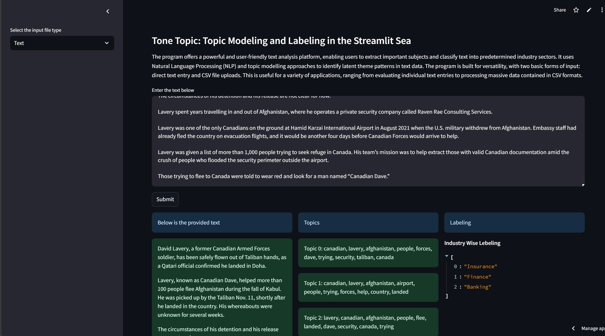

# Topic-Modeling-and-Labeling-App-With-Whisper-and-Streamlit
Topic Modeling and Labeling App powered by Whisper and Streamlit
# Introduction
This application offers a friendly way to explore text through topic modeling and industry labeling. It uses LDA (Latent Dirichlet Allocation) from the Gensim library to uncover hidden themes in your text data, then classifies the results into predefined industries like Insurance, Finance, Healthcare, Media, and more. It’s designed to be flexible, allowing either direct text input or CSV uploads for larger datasets1.
# Key Highlights
## Interactive Topic Modeling
- The app processes text, identifies the most probable words per topic, and displays them clearly.
## Industry Classification
- It automatically matches the text against industry-specific keywords, returning a top label or multiple possible matches.
## Multiple Input Options
- You can enter text manually or upload a CSV file, making it suitable for both small-scale demos and bulk analyses.
## Installation
- Clone or download the repository.
- Install the required dependencies from the provided file:
bash
pip install -r requirements.txt
Dependencies include Gensim, Streamlit, and OpenAI Whisper for broader NLP capabilities2.
## How to Run
Navigate to the project folder.
Start the Streamlit application:
bash
streamlit run app.py
This will launch a user-friendly web interface in your default browser.
Using the App
Direct Text Analysis
Type or paste text into the text area.
Click "Submit" to see the discovered topics and industry labels displayed side by side.
CSV File Analysis
Upload a CSV with a column named “Data” containing your text.
Click “Submit CSV File” to process multiple rows and automatically assign industries

